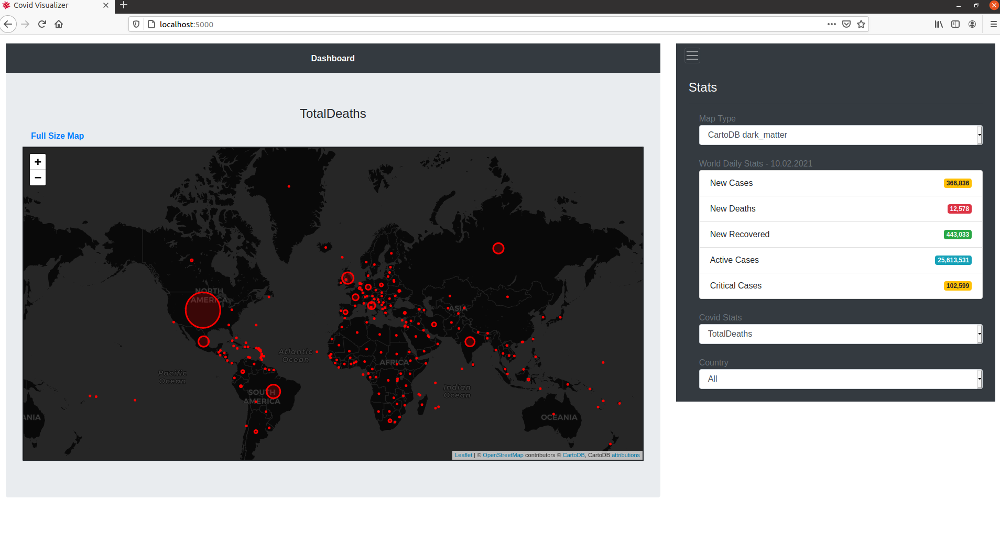

# Covid-19 Visualizer using Flask

Here, I created a geographical map to visualize Covid-19 stats in the world using python flask framework and folium library.

Stats are retrieved from the https://www.worldometers.info/coronavirus/ website and can be updated everyday.

## Required Packages

- covid-daily
- Flask
- folium
- geopy
- Jinja2
- numpy
- pandas
- python-dateutil

## How to Run

After installing the required packages, you can simply run the code as `python wsgi.py` and open the url

[localhost:5000](http://localhost:5000/) in your browser.

Here is the sample screenshot:

  

## Reference

- https://www.worldometers.info/coronavirus/